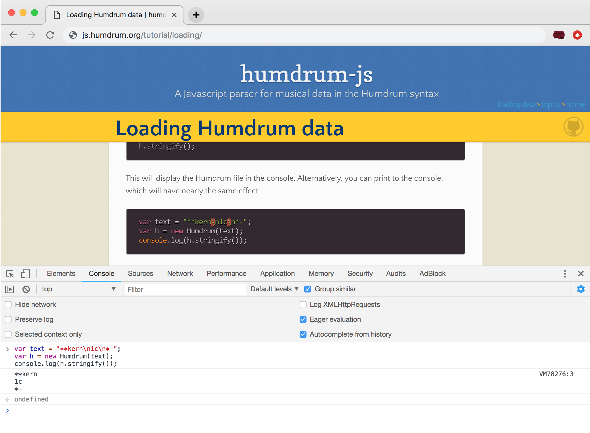



Data can be loaded into a Humdrum object either when it is created,
or later by calling Humdrum.parse.  Data can be loaded from a string
or text in the HTML DOM, or it can be downloaded from the internet as
a URL or URI.

When loading from a string, an element or from a reference to an element,
the data is processed immediately.  When loading from a URL or URI,
it will take some amount of time to download the data.  Therefore, to
continue processing the file after loading a URL/URI, you need to assign
a function to Humdrum.onload.  This function will be called after the
data has been downloaded and parsed into the Humdrum object.

# Loading from a string #

Here is an example of loading data from a string when creating a Humdrum object:

```javascript
var text = "**kern\n1c\n*-";
var h = new Humdrum(text);
```

Try copy-and-pasting the above code into the javascript console for your
browser.  You can usually open the console by typing control/command +
alt/option + i/j.  The exact key combination will depend on your browser
and operating system.  After entering those two commands, you can then
use the Humdrum.stringify function to output a string containing the
contents of the Humdrum object:

```javascript
var text = "**kern\n1c\n*-";
var h = new Humdrum(text);
h.stringify();
```

This will display the Humdrum file in the console.  Alternatively,
you can print to the console, which will have nearly the same effect:

```javascript
var text = "**kern\n1c\n*-";
var h = new Humdrum(text);
console.log(h.stringify());
```

Here is an image showing the process of copy-and-pasting the above
javascript code on the console:


<a target="_blank" href="console.png"></a>

(Click on the image to view in more detail.)

Notice the text that shows up after the javascript code that was pasted:

```
**kern
1c
*-
```

This is the contents of the Humdrum object that was extracted using the Humdrum.stringify
function.


Here is an example of loading data from a string after creating a Humdrum
object by using the parse function:

```javascript
var text = "**kern\n1c\n*-";
var h = new Humdrum();
h.parse(text);
```

The Humdrum object is first created, giving no initialization arguments, and later
the Humdrum.parse function is run to read the data into the object.


# Loading text extracted from an element #

Data can be loaded directly from an element's text content.  The element
should be a `<script>`, with the type set to `text/x-humdrum`.  Script
elements do not have their contents parsed by the HTML interpreter,
so characters such as &gt; and &lt; are not treated as element markers.

Here is an example script that is embedded in the webpage:

```
<script id="twinkle" type="text/x-humdrum">
**kern
*M4/4
=1
4c
4c
4g
4g
=2
4a
4a
2g
=3
4f
4f
4e
4e
=4
4d
4d
2c
==
*-
</script>
```

<script id="twinkle" type="text/x-humdrum">
**kern
*M4/4
=1
4c
4c
4g
4g
=2
4a
4a
2g
=3
4f
4f
4e
4e
=4
4d
4d
2c
==
*-
</script>

Here is an example of how to extract the text from the element using
the .innerHTML variable of the element.

```javascript
var text = document.querySelector("#twinkle").innerHTML;
var h = new Humdrum(text);
```

Try copy-and-pasting that code into the javascript console, and then
printing the contents of the `h` variable.


# Loading from an element #

The Humdrum object or Humdrum.parse can be given an HTML element, and
it will extract the text from the element automatically.

```javascript
var element = document.querySelector("#twinkle");
var h = new Humdrum(element);
```

# Loading from an element ID #

The laziest way to loaded content from a webpage is to give an ID reference
as input into the Humdrum object parser:

```javascript
var h = new Humdrum("#twinkle");
```

The Humdrum object will find the element, and extract the text content
for you.  The string `#twinkle` starts with a `#` character, which
indicates that the following text is the ID of an element.  In the above
example data, the ID was set to `twinkle`, so the element can be found
using this ID.


# Loading from a URL #

Previous examples have show how to load data from the webpage or from a
string variable.  You can also download data from a URL.  The data
can be either stored on the same server as the webpage, or a remote server.

Here is an example of loading a Humdrum file from the same server:

```javascript
var h = new Humdrum();
h.onload = function (x) {
   console.log("Downloaded data:");
   console.log(h.stringify());
}
h.parse("twinkle.txt");
```

Notice the use of the Humdrum.onload function in this example.  Since the Humdrum data
needs to be downloaded from a location external to the webpage, a separate thread will be
created to wait for the data to be downloaded.  Therefore, a function needs to be called
after the data has been downloaded and parsed into the Humdrum object.  Try the following 
code, and you should notice that nothing will be printed if you copy and paste all of the
lines of code at the same time:

```javascript
var h = new Humdrum("twinkle.txt");
console.log(h.stringify());
```

However, if you copy and paste each line separately, there should be content printed for the 
object.  This is because by the time you copy and paste the second line, the data has been
downloaded and parsed for the first line of code.  So in an interactive environment you do
not usually have to use the Humdrum.onload function, but in non-interactive situations, 
it is required for loading external data from a URL.


# Loading from a URI #

There are several short-cuts to Humdrum data available on the web.  These shortcuts
are URIs (Uniform Resource Identifier).  They are internally mapped into URLs in the
Humdrum parsing functions.

## Github URI ##

Github URIs are prefixed with `github://` (long form) or `g://` (short form).  This
URI will download data from a repository on Github.  The basic form of the URI is:

```
github://username/repository-name/path/to/file/filename.krn
```

For example, here is how to download the first movement
of Beethoven's first piano sonata from the repository at
[https://github.com/craigsapp/beethoven-piano-sonatas](https://github.com/craigsapp/beethoven-piano-sonatas):

```javascript
var h = new Humdrum();
h.onload = function (x) {
   console.log("The downloaded data has", x.getLineCount(), "lines.");
}
h.parse("g://craigsapp/beethoven-piano-sonatas/kern/sonata01-1.krn");
```

If you copy and paste that code into the javascript console, it should
state that there are 1429 lines in the downloaded Humdrum data.  Note that
the short form (`g://`) of the Github URI is being used in the example.

### Downloading an older file from Github ###

You can add a parsing option called `commitHash` to the parsing command
to download a particular version of a Humdrum file from Gihtub.  Here is
an example using the same Beethoven sonata, but an older version of the
data stored with commit `8b4258c`.

```javascript
var h = new Humdrum();
h.onload = function (x) {
   console.log("The downloaded data has", x.getLineCount(), "lines.");
}
var uri = "g://craigsapp/beethoven-piano-sonatas/kern/sonata01-1.krn";
var options = {commitHash: "8b4258c"};
h.parse(uri, options);
```

In this case the data should have 1427 lines instead of 1429 lines that
the most recent version of the Humdrum file has.


commitHash:"8b4258c"

## Humdrum URI ##

The same score can be downloaded with the Humdrum URI, which is
either `humdrum://` for the long form, `hum://` for the medium
form, or `h://` for the short form.  This will load data from
[kernScores](http://kern.humdrum.org).

```javascript
var h = new Humdrum();
h.onload = function (x) {
   console.log("The downloaded data has", x.getLineCount(), "lines.");
}
h.parse("h://beethoven/sonatas/sonata01-1.krn");
```

View the [shortcuts page](http://kern.humdrum.org/cgi-bin/kscuts) for some example kernScore
locations that can be used for the Humdrum URI.  The long for this particular sonata is
from [this page](http://kern.ccarh.org/cgi-bin/ksbrowse?l=/users/craig/classical/beethoven/piano/sonata).

```javascript
var h = new Humdrum();
h.onload = function (x) {
   console.log("The downloaded data has", x.getLineCount(), "lines.");
}
h.parse("h://users/craig/classical/beethoven/piano/sonata/sonata01-1.krn");
```


## Josquin Research Project URI ##

The [Josquin Research Project](http://josquin.stanford.edu) has a
Humdrum file database of about 1500 works from the late Medieval and
early Renaissance periods.  They can be downloaded using the `jrp://`
(long form) or `j://` (short form) URI.  To access a file, give only
the catalog number of the work in the JRP database.  For example
[Jos2721](http://josquin.stanford.edu/work/?id=Jos2721) is for the
song <i>La Bernardina</i>:

```javascript
var h = new Humdrum();
h.onload = function (x) {
   var title = h.refs.database["OTL"][0].value
   console.log("The title of the downloaded work:", title);
}
h.parse("j://Jos2721");
```

Access to the title will be improved in the future, currently it is cryptic on how to extract it.
In this case the above javascript code should print:

```unparsed
The title of the downloaded work: La Bernardina
```


