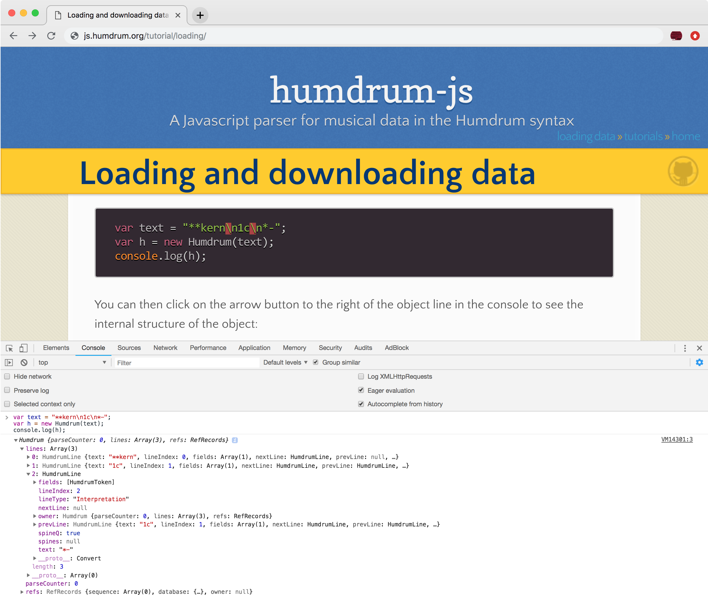




This tutorial covers various ways that data can be loaded into
a <span class="obj">Humdrum</span> object.  Data can be loaded
either when the object is created, or later by calling <span
class="objfunc">Humdrum.parse</span>.  Data can be loaded either from
a string or from text extracted from the HTML DOM, or it even can be
downloaded from the internet with a URL or URI.

When loading from a string, an element or with a ID reference to an
HTML element, the data is processed immediately; however, when loading with
a URL or URI, it will take some amount of time to download the data
before it can be processed.  Therefore, to continue processing the
parsed data after loading a URL/URI, you need to assign a function
to <span class="objvar">Humdrum.onload</span>.  This function will
be called after the data has been downloaded and parsed into a <span
class="obj">Humdrum</span> object.


# Loading from a string #

Here is an example of loading data from a string when creating a <span class="obj">Humdrum</span> object:

```javascript
var text = "**kern\n1c\n*-";
var h = new Humdrum(text);
```

Try copy-and-pasting the above code into the javascript console of your
browser.  You can usually open the console by typing control/command +
alt/option + i/j.  The exact key combination will depend on your browser
and operating system.  After entering the above two javascript lines,
you can then use the <span class="objfunc">Humdrum.stringify</span>
function to output a string containing the contents of the <span
class="obj">Humdrum</span> object:

```javascript
var text = "**kern\n1c\n*-";
var h = new Humdrum(text);
h.stringify();
```

This will display the Humdrum data in the console.  Alternatively,
you can print the data string to the console, which will have nearly
the same effect:

```javascript
var text = "**kern\n1c\n*-";
var h = new Humdrum(text);
console.log(h.stringify());
```

Here is an image showing the process of copy-and-pasting the above
javascript code on the console:


<a target="_blank" href="console.png"></a>

(Click on the image to view in more detail.)

Notice the text that shows up after the javascript code that was pasted:

```
**kern
1c
*-
```

This is the contents of the <span class="obj">Humdrum</span> object that
was extracted using the <span class="objfunc">Humdrum.stringify</span>
function.

You can also view the internal structure of the <span class="obj">Humdrum</span>
object by printing the object variable itself rather than the stringified version
of the object:

```javascript
var text = "**kern\n1c\n*-";
var h = new Humdrum(text);
console.log(h);
```

You can then click on the arrow button to the right of the object line in the console
to see the internal structure of the object:

<a target="_blank" href="console-object.png"></a>

(Click on the image to view in more detail.)


## Delayed text loading ##

Here is an example of loading data from a string after
creating a <span class="obj">Humdrum</span> object by using
the <span class="objfunc">Humdrum.parse</span> function.
Instead of loading the data immediately upon creation of the <span
class="obj">Humdrum</span> object, the data is loaded using the
<span class="objfunc">Humdrum.parse</span> function afterwards.

```javascript
var text = "**kern\n1c\n*-";
var h = new Humdrum();
h.parse(text);
```

When loading text content into a <span class="obj">Humdrum</span> object,
either method gives the same results; however, when loading data with
a URL/URI, the data will usually be parsed after creating the object
(more about that in the URL section of the tutorial).


# Loading text from an HTML element #

An alternate and more convenient way of storing and accessing text content
to be loaded into a <span class="obj">Humdrum</span> object is to extract
it from an HTML element on the webpage.  The element should preferably
be a `<script>` element so that its contents is always stored in the DOM
as a string rather than as an HTML element tree (more on that later).
Script tags always contain plain text, which allows all characters
to remain unaltered when reading or writing the Humdrum data to/from
the element.

Normally a `<script>` element contains a javascript program.  You need to
explicitly tell the web-browser that its contents is not a javascript
program by setting the value of the script's `type` attribute to
`text/x-humdrum`.  This is a MIME type for Humdrum data: `text` means
that the contents is plain text, and the `x-` prefix means that `humdrum`
is not a standard MIME subtype.

Below is an example Humdrum data script that is embedded into this webpage
(this is not the actual script, which is hidden).  Also note that the
element is assigned a unique identifier of `twinkle` which allows easy
access to the element in javascript.

```
<script id="twinkle" type="text/x-humdrum">
**kern
*M4/4
=1
4c
4c
4g
4g
=2
4a
4a
2g
=3
4f
4f
4e
4e
=4
4d
4d
2c
==
*-
</script>
```

<script id="twinkle" type="text/x-humdrum">
**kern
*M4/4
=1
4c
4c
4g
4g
=2
4a
4a
2g
=3
4f
4f
4e
4e
=4
4d
4d
2c
==
*-
</script>

Here is an example of how to extract the text from the element using
the <span class="var">textContent</span> variable of the element.

```javascript
var element = document.querySelector("#twinkle");
var text = element.textContent;
var h = new Humdrum(text);
```

The first line finds the Humdrum script element labeled with the ID
`twinkle` on the page.  The second line extracts the text content
from the element, and the third line loads the data into a <span
class="obj">Humdrum</span> object.  Try copy-and-pasting that code
into the javascript console, and then printing the contents of the
`h` variable.

The first two lines of the code can be merged into a single
step like this (provided that an element was found with <span
class="func">querySelector</span>):

```javascript
var text = document.querySelector("#twinkle").textContent;
var h = new Humdrum(text);
```

And even one line can be done:

```javascript
var h = new Humdrum(document.querySelector("#twinkle").textContent);
```

Although if you cannot guarantee that an element with the twinkle ID exists
on the webpage, then it is better to do error checks:

```javascript
var element = document.querySelector("#twinkle");
if (element) {
   var h = new Humdrum(element.textContent);
} else {
   console.log("Error: cannot find twinkle data");
}
```


# Loading from an HTML element #

The <span class="obj">Humdrum</span> object or <span
class="objfunc">Humdrum.parse</span> can be given an HTML element,
and they will extract text content from the element automatically.
In other words, you do not need to extract text from the element
with <span class="var">textContent</span> yourself, since the <span
class="obj">Humdrum</span> parser can do that for you:

```javascript
var element = document.querySelector("#twinkle");
var h = new Humdrum(element);
```


## Automatic escaping text in non-script elements ##

Although it is recommended to use a `<script>` element to store Humdrum
text within a webpage, you can actually store Humdrum data in any HTML
element, as long as special HTML characters are escaped as HTML entities.
Mostly this involves using `&amp;` for `&`, `&lt;` for `<` and `&gt;` for
`>`.  This subsection goes into the gory details of the differences between
`<script>` and other elements.  If you plan to always store data using
a `<script>` element, then you can skip this section; but otherwise,
you will have to suffer reading through it.


Here is an example of correctly encoded data stored in a non-script element:

```parseltongue
<div id="humdiv">
**text
some
&lt;text&gt;
in
&lt;/text&gt;
angle
brackets
*-
</div>
```

<div style="display:none;" id="humdiv">
**text
some
&lt;text&gt;
in
&lt;/text&gt;
angle
brackets
*-
</div>

If this data were stored in a `<script>` rather than a `<div>`, then
the correct encoding would match the raw Humdrum data:

```parseltongue
<script type="text/x-humdrum" id="humscript">
**text
some
<text>
in
</text>
angle
brackets
*-
</div>
```

<script type="text/x-humdrum" id="humscript">
**text
some
<text>
in
</text>
angle
brackets
*-
</script>

In both cases, data can be extracted correctly from elements with the 
<span class="var">.textContent</span> variable of the element:


```javascript
var dive = document.querySelector("#humdiv");
var scripte = document.querySelector("#humscript");
console.log("DIV TEXT:", dive.textContent);
console.log("SCRIPT TEXT:", scripte.textContent);
```

In both cases the extracted texts will be the same:

```parseltongue
DIV TEXT: 
**text
some
<text>
in
</text>
angle
brackets
*-

SCRIPT TEXT: 
**text
some
<text>
in
</text>
angle
brackets
*-
```

However, notice that if you do not HTML escape text in a non-script
element, the returned text may be messed up, since the text was parsed
as if it were HTML code when it is not:

```parseltongue
<div id="humdivbad">
**text
some
<text>
in
</text>
angle
brackets
*-
</div>
```

<div style="display:none;" id="humdivbad">
**text
some
<text>
in
</text>
angle
brackets
*-
</div>

```javascript
var divbad = document.querySelector("#humdivbad");
console.log("DIV BAD TEXT:", divbad.textContent);
```

The above code will generate the output:

```parseltongue
DIV BAD TEXT: 
**text
some

in

angle
brackets
*-
```

The problem is that `<text>` and `</text>` look like HTML elements, and
the HTML parser converted them into elements when loading the page (as it
should be expected to do so).  The <span class="var">textContent</span>
variable extracts the plain text portions of an element's contents,
so it will remove any element tags.  You could try to extract the HTML
content of the div instead:

```javascript
var divbad = document.querySelector("#humdivbad");
console.log("NEW DIV BAD HTML:", divbad.innerHTML);
```

which will give the desired text:

```parseltongue
NEW DIV BAD HTML: 
**text
some
<text>
in
</text>
angle
brackets
*-
```

but the problem is that the Humdrum data was parsed into HTML elements
inadvertently when the page was loaded.  Since they looked very much
like HTML code, the original content could be reconstructed with <span
class="var">innerHTML</span>. But if the angle brackets do not make
sense to the HTML parser, it will escape them to treat as regular text:


```parseltongue
<div id="humdivbad2">
**text
some
<text
in
/text>
angle
brackets
*-
</div>
```

<div style="display:none;" id="humdivbad2">
**text
some
<text
in
/text>
angle
brackets
*-
</div>


Now when using <span class="var">innerHTML</span> on the 
new example, the `<` and `>` characters have been escaped
by the HTML parser to indicate that it does not think they
are part of HTML element tags and should be interpreted as
plain text.

```javascript
var divbad2 = document.querySelector("#humdivbad2");
console.log("DIV BAD 2 HTML:", divbad2.innerHTML);
```

Results in escaped characters in the data extraction:

```parseltongue
DIV BAD 2 HTML: 
**text
some
&lt;text
in
/text&gt;
angle
brackets
*-
```

In this case you would need to use <span class="var">textContent</span>
to unescape the escaped characters:

```javascript
var divbad2 = document.querySelector("#humdivbad2");
console.log("DIV BAD 2 TEXT:", divbad2.textContent);
```

```parseltongue
DIV BAD 2 TEXT: 
**text
some
<text
in
/text>
angle
brackets
*-
```

but that would mean that sometime you need <span
class="func">textContent</span> and at other times <span
class="func">innerHTML</span> to extract the correctly formatted data, and
this cannot be predicted with 100% accuracy.


The moral of the story is that the Humdrum data stored in an HTML element
must be stored as plain text so that the HTML parser does not try to
create HTML elements out of the data.  If you do not escape the Humdrum
data contents when writing it inside of an element other than `<script>`,
the HTML parser will try to interpret what it finds as HTML data rather
than Humdrum data.  The `<script>` tag does not have this problem, so
you do not need to be as careful, since the HTML parser knows that it
always must treat the contents of `<script>` as plain text.

When writing Humdrum data to a non-script element within javascript,
you must use the <span class="var">textContent</span> variable rather
than <span class="var">innerHTML</span>.  This will escape any special
characters that HTML may otherwise process.  Then when extracting
the data, use <span class="var">textContent</span> again.  This will
transparently reverse the process to unescape the special characters.
When using a `<script>` element, both <span class="var">textContent</span>
or <span class="var">innerHTML</span> can be used since they will have
equivalent behaviors. But, as has been illustrated in this section,
non-script elements they can have different behaviors when using <span
class="var">innerHTML</span> or mixing <span class="var">innerHTML</span>
and <span class="var">textContent</span>.


Also keep in mind that if you are typing Humdrum data by hand into a non-script
element on a webpage, you will have to escape the characters `&`, `<` and `>` to
avoid problems when extracting the text content from the element for loading
into the <span class="obj">Humdrum</span> object.


# Loading from an element ID #

The laziest way to load content from a webpage is to give an ID
reference as input into the <span class="obj">Humdrum</span> object
parser:

```javascript
var h = new Humdrum("#twinkle");
```

or with delayed data loading:

```javascript
var h = new Humdrum();
h.parse("#twinkle");
```

The <span class="obj">Humdrum</span> object will find the element, and
extract the text content for you.  The string `#twinkle` starts with a
`#` character, which indicates that the following text is the ID of
an element.  In the above example data, the ID was set to `twinkle`,
so the element can be found using this ID.

If you want to use a different selector than an ID for some
reason, it is better to select the element yourself and then
give the selected element to the Humdrum initializer or <span
class="func">parse</span> function.  However, if you really want
humdrum-js to handle the selecting of the element, you can use the <span
class="objfunc">HumdrumBase.ParseSelector</span> function, which inputs
a selector as its argument, and will then choose the first element
on the page that matches to it for extracting the Humdrum data:

```javascript
var h = new Humdrum();
h.ParseSelector("script#twinkle");
```

If you try to do this:

```javascript
var h = new Humdrum();
h.parse("script#twinkle");
```

the intended selector would instead be automatically interpreted as
a URL to a local file called "script".


# Loading from a URL #

Previous examples have shown how to load data from an HTML element or from
a javascript string variable.  You can also download data from a URL.
The data can be either stored on the same server as the webpage, or a
remote server.

Here is an example of loading a Humdrum file from the same server:

```javascript
var h = new Humdrum();
h.onload = function (x) {
   console.log("Downloaded data:");
   console.log(h.stringify());
}
h.parse("twinkle.txt");
```

Notice the use of the <span class="objvar">Humdrum.onload</span> function
in this example.  Since the Humdrum data needs to be downloaded from a
location external to the webpage, a separate thread will be created to
wait for the data to be downloaded.  Therefore in order to do anything
useful with the parsed data, a function needs to be called after the data
will have been downloaded and parsed into the <span class="obj">Humdrum</span>
object.  Try the following code, and you should notice that nothing
will be printed if you copy and paste all of the lines of code at the
same time:

```javascript
var h = new Humdrum("twinkle.txt");
console.log(h.stringify());
```

However, if you copy and paste each line separately, there should be
content printed for the object.  This is because by the time you copy
and paste the second line, the data has been downloaded and parsed
for the first line of code.  So in an interactive environment you do
not usually have to use the <span class="objvar">Humdrum.onload</span>
function, but in non-interactive situations, it is required for loading
external data from a URL.


# Loading from an external URL #

It is possible to download data from other web servers
rather than just the same web server that hosts the web page
humdrum-js is running in.  However, this will be dependent on the
remote server allowing indirect connections to its resources.
If you run a web server and want to allow <a target="_blank"
href="https://en.wikipedia.org/wiki/Cross-origin_resource_sharing">CORS</a>
(Cross Origin Resource Sharing), then you may have to
configure your web server to allow it.  <a target="_blank"
href="https://enable-cors.org/server_apache.html">Here</a> are
instructions for allowing this on an Apache webserver, for example.

The Github servers do allow remote access to data
files.  For example, the data for <a target="_blank"
href="https://github.com/craigsapp/beethoven-piano-sonatas/blob/master/kern/sonata01-1.krn">this
Github repository file</a> can be found <a target="_blank"
href="https://raw.githubusercontent.com/craigsapp/beethoven-piano-sonatas/master/kern/sonata01-1.krn">here</a>
(click on the "Raw button near the top of the previous link to get to
the plain text version of the file).  Here is an example of downloading data from that URL:

```javascript
var h = new Humdrum();
h.onload = function (x) {
   console.log("Composer of music:", h.getRefValue("COM").value);
   console.log("Number of lines in data:", h.getLineCount());
   console.log("Downloaded data:", h.stringify());
};
h.parse("https://raw.githubusercontent.com/craigsapp/beethoven-piano-sonatas/master/kern/sonata01-1.krn");
```

Running this code should result in the output:

<div style="max-height:600px; overflow:scroll">
<pre>
<code>
Composer of music: Beethoven, Ludwig van
Number of lines in data: 1429

</code>
</pre>
</div>

(scroll in the above black box to view the entire output).


## HTTP vs. HTTPS ##

If you are on a page served over the https protocol, then you will
likely not be able to load URLs that start with http.  If you are on a
page served via http, then loading a URL starting with https should not
be a problem.

# Using <span class="var">onload</span> from options #

The standard way of downloading a URL is to define a function to do
something with the data once it has been downloaded, and this function
is usually stored in <span class="objvar">Humdrum.onload</span>.  An alternate
method is to provide an option object with the <span class="func">onload</span>
function defined within it.  Here is the method described previously:

```javascript
h = new Humdrum();
h.onload = function (x) {
   console.log("Downloaded data has", x.getLineCount(), "lines");
}
h.parse("twinkle.txt");
```

An alternate method of providing a function is with the <span
class="var">onload</span> property of an object containing options as a
second parameter for parsing:

```javascript
var options = {onload: function (x) {
   console.log("Downloaded data has", x.getLineCount(), "lines");
}};
h = new Humdrum("twinkle.txt", options);
```

or equivalently (delaying the parsing):

```javascript
var options = {onload: function (x) {
   console.log("Downloaded data has", x.getLineCount(), "lines");
}};
h = new Humdrum();
h.parse("twinkle.txt", options);
```

or equivalently (assigning the function to a variable before storing in
the options object):

```javascript
var myfunction = function (x) {
   console.log("Downloaded data has", x.getLineCount(), "lines");
}
var options = {onload: myfunction};
h = new Humdrum("twinkle.txt", options);
```

or equivalently (not creating a separate variable to store the options to
<span class="obj">Humdrum</span>):

```javascript
var myfunction = function (x) {
   console.log("Downloaded data has", x.getLineCount(), "lines");
};
h = new Humdrum("twinkle.txt", {onload: myfunction});
```

or equivalently (using the options without a variable name in the parsing function):

```javascript
var myfunction = function (x) {
   console.log("Downloaded data has", x.getLineCount(), "lines");
};
h = new Humdrum();
h.parse("twinkle.txt", {onload: myfunction});
```


# Loading from a URI #

There are several short-cuts to Humdrum data URLs available on the web.
These shortcuts are URIs (Uniform Resource Identifier).  They are
internally mapped into URLs by the <span class="obj">Humdrum</span>
parsing functions.

## Github URI ##

Github URIs are prefixed with `github://` (long form), `gh://` (medium
form) or `g://` (short form).  This URI will download data from a
repository on Github.  The basic form of the URI is:

```unparsed
github://username/repository-name/path/to/file/filename.krn
```

For example:

```unparsed
github://craigsapp/beethoven-piano-sonatas/kern/sonata01-1.krn
```

is mapped internally in the <span class="objfunc">Humdrum.parse</span> function to the URL:

```unparsed
https://raw.githubusercontent.com/craigsapp/beethoven-piano-sonatas/master/kern/sonata01-1.krn
```

Here is how to download the first movement
of Beethoven's first piano sonata from the repository at
[https://github.com/craigsapp/beethoven-piano-sonatas](https://github.com/craigsapp/beethoven-piano-sonatas)
using the Github URI:

```javascript
var h = new Humdrum();
h.onload = function (x) {
   console.log("The downloaded data has", x.getLineCount(), "lines.");
}
h.parse("g://craigsapp/beethoven-piano-sonatas/kern/sonata01-1.krn");
```

If you copy and paste that code into the javascript console, it should
state that there are 1429 lines in the downloaded Humdrum data.  Note that
the short form (`g://`) of the Github URI is being used in the example.

## Downloading an older file from Github ##

You can add a parsing option called `commitHash` to the parsing command
to download a particular version of a Humdrum file from Github.  Here is
an example using the same Beethoven sonata, but an older version of the
data stored with commit `8b4258c`:

```javascript
var options = {
   commitHash: "8b4258c"
   onload: function (x) {
      console.log("The downloaded data has", x.getLineCount(), "lines.");
   }
};
var uri = "g://craigsapp/beethoven-piano-sonatas/kern/sonata01-1.krn";
var h = new Humdrum(uri, options);
```

In this case the data should have 1427 lines instead of 1429 lines that
the most recent version of the Humdrum file has.


## Humdrum URI ##

The same score can be downloaded with the Humdrum URI, which
is either `humdrum://` for the long form, `hum://` for the
medium form, or `h://` for the short form.  This will load
data from [kernScores](http://kern.humdrum.org).  The data
will be served over http, so this method cannot be used on
pages served over https.  Most larger collections of data in <a
target="_blank" href="http://kern.humdrum.org">kernScores</a>
are also available on Github in the <a target="_blank"
href="https://github.com/humdrum-tools/humdrum-data">humdrum-data</a>
repository.


Here is an example of downloading the same Beethoven piano sonata movement
with a Humdrum URI from kernScores:

```javascript
var h = new Humdrum();
h.onload = function (x) {
   console.log("The downloaded data has", x.getLineCount(), "lines.");
}
h.parse("h://beethoven/sonatas/sonata01-1.krn");
```

View the [shortcuts page](http://kern.humdrum.org/cgi-bin/kscuts)
for some example kernScores locations that can be used for the
Humdrum URI.  The long Humdrum URI for this particular sonata is from [this
page](http://kern.ccarh.org/cgi-bin/ksbrowse?l=/users/craig/classical/beethoven/piano/sonata):

```javascript
var h = new Humdrum();
h.onload = function (x) {
   console.log("The downloaded data has", x.getLineCount(), "lines.");
}
h.parse("h://users/craig/classical/beethoven/piano/sonata/sonata01-1.krn");
```


## Josquin Research Project URI ##

The [Josquin Research Project](http://josquin.stanford.edu) has a
Humdrum file database of about 1500 works from the late Medieval and
early Renaissance periods.  They can be downloaded using the `jrp://`
(long form) or `j://` (short form) URI.  To access a file, give
only the catalog number of the work in the JRP database.  For example
[Jos2721](http://josquin.stanford.edu/work/?id=Jos2721) is for the song
<i>La Bernardina</i>:

```javascript
var h = new Humdrum();
h.onload = function (x) {
   var title = h.getRefValue("OTL");
   console.log("The title of the downloaded work:", title);
}
h.parse("j://Jos2721");
```

In this case the above javascript code should print:

```unparsed
The title of the downloaded work: La Bernardina
```

The JRP URI is also mapped into a URL over http, so you cannot
use it on https-served webpages.  However, you can use a Github
URL or URI to download the data from the <a target="_blank"
href="https://github.com/josquin-research-project/jrp-scores">Github
repository</a> of the JRP digital scores.  In that case the full name
of the file (including the title of the work) is needed in the URL/URI
rather than just the catalog number.


